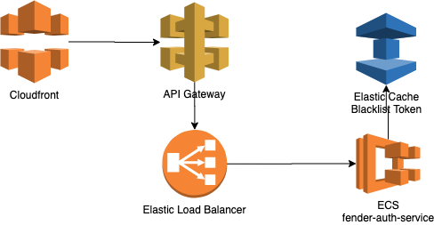

# Fender Digital Platform Engineering Challenge - EKWONG

## Description
Design and implement a RESTful web service to facilitate a user authentication system. 
The authentication mechanism should be *token based*. Requests and responses should be in **JSON**.

## Proposed AWS Architecture

* This project provides a working prototype of basic token authentication REST API service using node and Express. 
A working docker container is [built](#quick-start) and [tested](#quick-start). Test reports can be accessed in the test_reports folder 
## Features 
* User Registration
* User Sign In
* User access protected resource
* User update protected resource
* User Log out

## TODO 
* Role based user schema
* move token blacklist from local cache to ElasticCache
* set up Api Gateway, CloudFront and ELB
## Requirements
**Install Node and NPM**:

* Windows: [https://cloudlinuxtech.com/how-to-install-node-js-npm/](https://cloudlinuxtech.com/how-to-install-node-js-npm/)
* Mac: https://blog.teamtreehouse.com/install-node-js-npm-mac
* Linux: https://linuxconfig.org/how-to-install-node-js-on-linux

**Install Docker**: 
* Windows: https://docs.docker.com/docker-for-windows/install/
* Mac: https://docs.docker.com/docker-for-mac/install/
* Linux: https://docs.docker.com/engine/install/ , click on Installations per distro

<a name="environment-variable">
<b>Environment Variables</b>:
</a>

* Required environment variables :
    *  PGPASS - password used for database
    * PGTEST - boolean, set to true when running test.

* Setting environment variables:
    * Windows: http://www.dowdandassociates.com/blog/content/howto-set-an-environment-variable-in-windows-command-line-and-registry/
    * Mac: https://www.dowdandassociates.com/blog/content/howto-set-an-environment-variable-in-mac-os-x-terminal-only/
    * Linux: https://linuxize.com/post/how-to-set-and-list-environment-variables-in-linux/
* example : export PGPASS=password 
* verify environment variables:
    * echo $PGPASS : displays value. 

## Running and testing the project

**Installation**:
* clone this project
* run npm install in project directory
<a name="quick-start">
<b>Quick Start</b>:
</a>

* npm run fullTest : to build database and run all tests.
* npm run service-front : Start and run all services with console logging
    * interactive kill on console to end. 
* npm run service : Start and run all services in background
    * npm run stopdb : to stop services. 

 **Database**:
* Operations:
    * start - npm run startdb
    * stop - npm run stopdb
            
**Node Service**:
* scripts:
    * npm run app - runs express service
    
**Testing**:
* test scripts are saved in *.test.js format in test folder:
    * npm run test - runs all tests in test folder
        * signup.test.js - test user sign up
        * signin.test.js - test user sign in
        * logout.test.js - test user sign out
        * route.test.js - test default route
        * auth_access.test.js - test protected resource access
        * auth_update.test.js - test protected resource access
    * npm run fullTest - builds the database and runs all tests, shuts down database
    * html report available in test_reports/*.html folder

**Service**
* To start service, npm run service

**AWS Deployment**
* Requirements :
    * AWS account
    * [aws cli]("https://docs.aws.amazon.com/cli/latest/userguide/cli-chap-install.html") installed 
    * [** <your account id>** ]("https://docs.aws.amazon.com/IAM/latest/UserGuide/console_account-alias.html#FindingYourAWSId").dkr.ecr. **<your region>** .amazonaws.com
    * set account id and region in format above
* Log in to ecr : 
    * aws ecr get-login-password --region us-east-1 | docker login --username AWS --password-stdin [** <your account id>** ]("https://docs.aws.amazon.com/IAM/latest/UserGuide/console_account-alias.html#FindingYourAWSId").dkr.ecr. **<your region>** .amazonaws.com
* Create new ECR repository
    * aws ecr create-repository --repository-name **<repo name>** --region **<your region>** 
        * response output contains key: **repositoryUri**, save that value
        * example:
        * {
    "repository": {
        "repositoryArn": "**arm value**",
        "registryId": "**registry id**",
        "repositoryName": "**repo name**",
        "repositoryUri": "**url**",
       ..
    }
}
* Tag image
    * docker images - get IMAGE ID of your image
    * docker tag **imageid** **repositoryUrl**
* Deploy to ECR
    * docker push **repositoryUrl**
* Create ECS Cluster configuration
    * ecs-cli configure --cluster fender-auth --default-launch-type FARGATE --config-name fender-config --region **<your region>**
    * configure ecs-params.yml with subnet id and security group
    * Create Task
        * ecs-cli compose --project-name fender-auth-service --file docker-compose.yml --ecs-params ecs-params.yml --region **<your region>** create --launch-type FARGATE
    * Create ECS
        * ecs-cli up --cluster-config  fender-auth --vpc **<vpc id>** --subnets **<subnet id** --security-group **<security group id**
    * Start ECS
        * ecs-cli compose --project-name fender-auth-service up --force-deployment --create-log-groups --cluster-config  fender-auth
    
**Troubleshooting**:
* to restart database 
    * npm run stopdb && npm run startdb
* Postgres authentication error
    * ensure environmental variables are set - look at [environment variable](#environment-variable) section above.
    * try running commands with environment variable. example:
        * PGPASS=thepassword PGTEST=true npm run startdb 
        * PGPASS=thepassword PGTEST=true npm run test 
        * PGPASS=thepassword PGTEST=true npm run stopdb 
        

